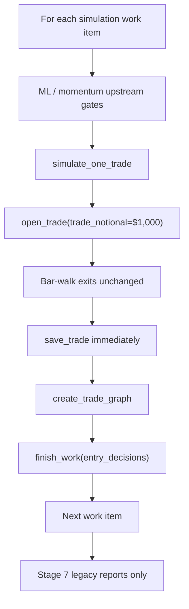
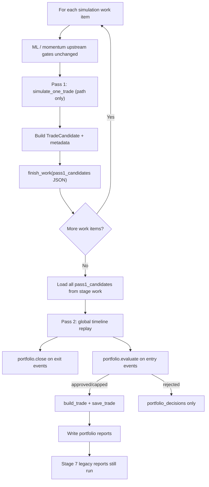

# Portfolio Layer — Technical Handoff & Implementation Summary

This document is the permanent technical reference for the Portfolio Management Layer integrated into the AlgoTrader event-driven backtester. It serves two audiences:

1. **Developers** who have not seen this project before — full implementation detail, architecture, and usage.
2. **Specification reviewers** (e.g. Aviv) — compliance status, validation blockers, and intentionally deferred scope.

**Specification:** `PORTFOLIO_LAYER_PLAN.md` (FINAL approved spec)  
**Default behavior:** Legacy fixed-$1,000 independent-trade simulation (`portfolio_enabled=False`)  
**New behavior:** Shared-capital portfolio simulation with risk-based sizing (`portfolio_enabled=True`)

---

# 0. Specification Compliance Summary

This matrix maps **FINAL spec requirements** (`PORTFOLIO_LAYER_PLAN.md`) to implementation and validation status. Use it for a quick compliance review before reading the full document.

| Specification Requirement | Status | Notes |
|---------------------------|--------|-------|
| Two-Pass Replay | ✅ Implemented | Pass 1 → `pass1_candidates` → Pass 2 replay |
| Exit-before-entry ordering | ✅ Implemented | Same-timestamp exits processed before entries |
| Deterministic replay | ✅ Implemented | Unit-tested timeline sort; tie-break via `CAP_ORDER` |
| Risk-based stop sizing | ✅ Implemented | Default downside-to-stop; spec test 1 covered |
| PortfolioState | ✅ Implemented | Cash, positions, MTM equity, heat, drawdown |
| MTM Equity | ✅ Implemented | `portfolio/mtm.py`; equity curve report |
| Portfolio Heat | ✅ Implemented | Sum of open risk-to-stop; heat cap enforced |
| Event Exposure Cap | ✅ Implemented | Per-`event_id` notional limit |
| Sector Exposure Cap | ✅ Implemented | `UNKNOWN` bucket when metadata missing |
| Theme Exposure Cap | ✅ Implemented | Tags from `BacktestConfig.included_tags` |
| Country Exposure Cap | ✅ Implemented | Country tags from asset metadata |
| Gross/Net Exposure Caps | ✅ Implemented | Long/short 100% cash margin model |
| Drawdown Scaling | ✅ Implemented | Risk multiplier scales down with drawdown |
| Kill Switch | ✅ Implemented | Blocks new entries when drawdown threshold hit |
| PortfolioDecision | ✅ Implemented | Structured approve / cap / reject with reason codes |
| Resume Strategy | ⚠️ Implemented but not E2E validated | JSON round-trip unit-tested; no live `stage_work` replay |
| Legacy Compatibility | ⚠️ Implemented but not E2E validated | Default `portfolio_enabled=False`; path unchanged in code |
| Acceptance Test 38 | ❌ Not yet validated | Requires DB — legacy byte-identical historical run |
| Acceptance Test 39 | ❌ Not yet validated | Requires DB — passthrough timestamp match on live output |
| Full End-to-End Backtest | ❌ Not yet validated | Requires DB — all 7 stages with `portfolio_enabled=True` |

**Legend:** ✅ = implemented and covered by unit tests where applicable · ⚠️ = code complete, pipeline proof pending · ❌ = not yet run against real backtest data

See also: [Validation Items Blocked by Missing PostgreSQL Access](#validation-items-blocked-by-missing-postgresql-access), [Out of Scope (Not Part of This Implementation)](#out-of-scope-not-part-of-this-implementation), and [Reviewer Summary](#reviewer-summary).

---

# 1. Executive Summary

## What the Portfolio Layer is

The Portfolio Layer sits **between trade candidate generation and trade booking** in the simulation stage. Instead of opening every approved signal at a fixed **$1,000** notional with no shared capital, it:

- Maintains one compounding **cash account** and **mark-to-market (MTM) equity**
- Sizes each trade by **risk to stop** (downside-to-stop sizing)
- Enforces **exposure, heat, liquidity, and drawdown** limits
- Emits structured **`PortfolioDecision`** objects (approve / cap / reject / kill-switch)
- Produces **portfolio-level reports** (equity curve, exposure, decision log)

## Why it was added

The legacy backtester answers: *“Were individual signals profitable?”*  
The Portfolio Layer answers: *“As one capital-constrained account, would this strategy have compounded without blowing up?”*

That requires shared capital, comparable risk per trade, aggregate exposure control, and a true MTM equity curve — none of which existed in the legacy path.

## Which specification it implements

Implementation follows **Option 2 (mandatory core)** from `PORTFOLIO_LAYER_PLAN.md`:

- Risk-based downside-to-stop sizing (default)
- Portfolio exposure limits (event, sector, theme, country, gross/net, heat)
- Structured portfolio decisions
- Two-pass replay architecture
- Kill-switch and drawdown-aware scaling
- Additive integration — legacy path preserved

## High-level architecture

```text
Upstream pipeline (unchanged)
  event_filter → probabilities → asset_worlds → prices → ml_observations
       ↓
  simulation stage
       ↓
  ┌─────────────────────────────────────────────────────────────┐
  │ Legacy (portfolio_enabled=False)                            │
  │   simulate_one_trade → open_trade($1,000) → save_trade       │
  └─────────────────────────────────────────────────────────────┘
  ┌─────────────────────────────────────────────────────────────┐
  │ Portfolio (portfolio_enabled=True)                          │
  │   Pass 1: capital-free path simulation → TradeCandidate     │
  │   Pass 2: global timeline replay → Portfolio.evaluate        │
  │           → sized Trade → save_trade + portfolio reports     │
  └─────────────────────────────────────────────────────────────┘
       ↓
  reports stage (legacy reports + portfolio reports when enabled)
```

**Design invariant:** Portfolio decisions only change **quantity**. Entry/exit timestamps, prices, and exit reasons come from Pass 1 and are never altered by portfolio logic.

---

# 2. Implementation Summary

## P0 fixes (prerequisites)

Before Portfolio Layer work, the clean codebase had broken imports. These were restored:

| Item | File(s) | What was done |
|------|---------|---------------|
| **Security master** | `database/backtesting/security_master.py` | `SecurityMaster`, symbol resolution, NASDAQ/otherlisted parsing, `download_security_master_entries()` |
| **Security master DB repo** | `database/backtesting/repositories/security_master.py` | `security_master_entries`, `save_security_master_entries`, `save_run_asset_resolution`, `run_asset_resolutions` |
| **Asset selection experiments repo** | `database/backtesting/repositories/asset_selection_experiments.py` | Repository stubs matching schema for A/B experiment tables |
| **Asset selection CLI stub** | `main_backtesting/asset_selection_experiment.py` | Importable module; raises `NotImplementedError` if CLI invoked (pipeline stub only) |

These fixes unblock the **prices stage** (symbol resolution) and allow the project to import cleanly.

---

## Portfolio package (`portfolio/`)

### `portfolio/__init__.py`

**Purpose:** Public exports for tests and integration code.

**Exports:** `PortfolioConfig`, `Portfolio`, `PortfolioState`, `PortfolioDecision`, `TradeCandidate`, `DecisionStatus`, replay helpers, serialization, candidate builder utilities.

---

### `portfolio/config.py`

**Purpose:** All portfolio-layer tunables (`PortfolioConfig`).

**Key items:**
- `PortfolioConfig` dataclass with §15 defaults from the spec
- `with_passthrough_profile()` — disables caps for regression test 39
- `resolved_theme_tags()` — derives theme tag set from `BacktestConfig.included_tags`
- JSON serialization for frozen run config

---

### `portfolio/models.py`

**Purpose:** Core data structures and enums.

**Key types:**
- `TradeCandidate` — immutable Pass 1 artifact
- `Position` — open book entry
- `PortfolioState` — live accounting state
- `PortfolioDecision` — structured admission decision
- `DecisionStatus` — status enum
- `CAP_ORDER` — deterministic cap tie-break order

---

### `portfolio/sizing.py`

**Purpose:** Step 1 sizing math.

**Functions:**
- `effective_risk_pct(config, drawdown)` — drawdown de-risk schedule
- `risk_target_quantity(...)` — risk-based or fixed-fraction target size
- `floor_to_lot(quantity)` — integer share floor

---

### `portfolio/constraints.py`

**Purpose:** Missing-data normalization, cap computation, volume gate checks.

**Functions:**
- `normalize_candidate()` — §10.1 fallbacks, validity checks
- `volume_gate_reject()` — Polymarket volume quality enforcement
- `compute_caps()` — all active cap headrooms
- `apply_caps()` — min-of-caps with deterministic binding
- `estimate_commission()` — wraps `ib_style_commission` with fallback

---

### `portfolio/mtm.py`

**Purpose:** Mark-to-market equity for sizing and drawdown.

**Functions:**
- `last_close_at_or_before(bars, timestamp)`
- `mark_to_market(state, timestamp, bars_by_key)`
- `refresh_state_marks(state, timestamp, bars_by_key, kill_switch_drawdown_pct)`
- `build_bar_index(bars_by_key)`

**Rule:** `E_t = cash + Σ MTM(open positions)` using last bar close ≤ t per position resolution.

---

### `portfolio/portfolio.py`

**Purpose:** Main portfolio engine.

**Class:** `Portfolio`

**Methods:**
- `evaluate(candidate)` — full §9.3 constraint cascade; returns `PortfolioDecision`
- `open(candidate, decision)` — books position, updates cash/exposures/heat
- `close(candidate)` — realizes PnL at Pass 1 exit price, frees exposure
- `build_trade(candidate, decision)` — constructs final sized `Trade` for DB save
- `record_snapshot(timestamp)` — appends equity/exposure time series

---

### `portfolio/replay.py`

**Purpose:** Pass 2 global timeline replay.

**Functions:**
- `build_timeline(candidates)` — merge entry/exit events
- `replay_portfolio(portfolio, candidates)` — exits-before-entries replay loop

**Sort key:** `(timestamp, exit_before_entry, entry_at, market_id, symbol)`

---

### `portfolio/candidate_builder.py`

**Purpose:** Build `TradeCandidate` from Pass 1 `Trade` + metadata.

**Functions:**
- `build_trade_candidate(...)` — assembles full candidate record
- `candidate_id_for(...)` — deterministic ID string
- `compute_adv(...)` — ADV from daily bars
- `partition_tags(...)` — theme vs country tag split
- `infer_archetype(...)` — ML observation or `event_archetype()` helper

---

### `portfolio/serialization.py`

**Purpose:** Pass 1 persistence JSON round-trip.

**Functions:**
- `candidate_to_dict(candidate)` — for `historical_backtest_stage_work.result`
- `candidate_from_dict(data)` — resume/replay loader

---

### `portfolio/reporting.py`

**Purpose:** File-only portfolio deliverables under `run_dir/reports/`.

**Functions:**
- `generate_portfolio_reports(portfolio, report_dir)` — writes all portfolio CSV/JSON/MD outputs

---

### `portfolio/attribution.py`

**Purpose:** Trade-level alpha row builder (M2 attribution scaffold).

**Function:** `compute_trade_alpha_rows(portfolio, candidates_by_id)`

---

## Integration modules (outside `portfolio/`)

| File | Role |
|------|------|
| `main_backtesting/config.py` | Added `portfolio_enabled`, `portfolio_config` |
| `main_backtesting/stages/simulation.py` | Legacy vs portfolio branching; Pass 1 collection; Pass 2 trigger |
| `main_backtesting/stages/simulation_portfolio.py` | Candidate assembly, bar reload, Pass 2 orchestration, trade save |
| `testing/test_portfolio_layer.py` | Unit/integration tests for portfolio rules |

---

# 3. Architecture Overview

## Legacy Mode — `portfolio_enabled=False`

### Flow



### Expected behavior

- Identical to pre-portfolio backtester
- Each trade uses `BacktestConfig.trade_notional` (default **$1,000**)
- No `pass1_candidates` in stage work results
- No portfolio CSV/JSON reports
- Momentum shadow grid unchanged (capital-free diagnostics)

---

## Portfolio Mode — `portfolio_enabled=True`

### Flow



### Expected behavior

- Upstream signal set unchanged (same candidates reach Pass 1)
- Trades saved **only after Pass 2** with portfolio-sized quantities
- Prior portfolio-booked trades for the run are deleted before re-save (idempotent replay)
- Portfolio reports written to `run_dir/reports/`
- Momentum **shadow** variants never produce `pass1_candidates` (only selected variant books capital)

---

## Pass 1

**Input:** Same data as legacy simulation per work item (market, asset, bars, ML/momentum context).

**Process:**
1. Run existing upstream gates (unchanged)
2. Call `simulate_one_trade()` — uses reference quantity (`trade_notional / entry_price`) for bar-walk only
3. Assemble `TradeCandidate` with sector, ADV, tags, volume quality, bar window
4. Persist JSON to `historical_backtest_stage_work.result.pass1_candidates`

**Output:** Immutable path record: `entry_at`, `exit_at`, `entry_price`, `exit_price`, `exit_reason`, stop geometry.

**Never recomputed in Pass 2.**

---

## Pass 2

**Input:** All `pass1_candidates` with `consumes_capital=True` from completed simulation work items + frozen `PortfolioConfig` + reloaded price bars.

**Process:**
1. Build global timeline of entry/exit events
2. Sort with **exits before entries** at each timestamp
3. For each exit → `portfolio.close()`
4. For each entry → `portfolio.evaluate()` → optionally `build_trade()` + `save_trade()`
5. Write portfolio reports

**Output:** Sized trades, decision log, equity/exposure streams.

---

## PortfolioState lifecycle

1. Created empty: `PortfolioState.empty(starting_capital)`
2. Before each entry evaluation: MTM refresh → equity, drawdown, kill-switch update
3. On approve: `open()` mutates cash, exposures, heat, positions
4. On exit event: `close()` releases margin, realizes PnL, reduces exposures/heat
5. Snapshots appended for reporting
6. **Not persisted to PostgreSQL** — rebuilt from scratch on every Pass 2 replay

---

## PortfolioDecision lifecycle

1. Created at each **entry** timeline event by `Portfolio.evaluate()`
2. Hard rejects return immediately without `open()`
3. Approved / approved_capped call `open()` after decision record built
4. All decisions appended to in-memory log → `portfolio_decisions.csv`
5. One decision per capital-consuming candidate at entry time

---

## Replay lifecycle

Pass 2 replay is a **pure function** of:

```text
f(pass1_candidates[], portfolio_config, bar_data) → decisions[], trades[], snapshots[]
```

Same inputs → same ordering, decisions, and outputs (deterministic tie-breaks enforced).

---

## Resume lifecycle

1. Simulation stage skips completed work items via `start_work()` → loads existing `pass1_candidates` from DB JSON
2. Incomplete work items run Pass 1 only
3. After all work items complete, Pass 2 reloads **all** candidates from stage work and replays from empty state
4. Partial Pass 2 state is **never** checkpointed to DB

---

# 4. Data Models

## TradeCandidate

**Purpose:** Immutable Pass 1 artifact — the sole input to `Portfolio.evaluate()` at entry time.

### Field summary (grouped)

| Group | Fields |
|-------|--------|
| **Identity** | `candidate_id`, `run_id`, `market_id`, `event_id`, `symbol`, `asset_name`, `pass_number`, `strategy_branch`, `portfolio_label`, `direction`, `consumes_capital` |
| **Timing** | `trigger_at`, `entry_at`, `resolution` |
| **Path (frozen)** | `entry_price`, `exit_at`, `exit_price`, `exit_reason`, `path_reference_quantity` |
| **Stop geometry** | `initial_stop`, `atr`, `stop_distance`, `range_period`, `range_multiplier` |
| **Signal (logged)** | `classification_probability`, `predicted_peak_percent`, `predicted_target_price`, `remaining_gap`, `directions_agree`, `price_momentum`, `probability_at_entry`, `event_archetype` |
| **Exposure keys** | `sector_key`, `theme_tags`, `country_tags` |
| **Liquidity** | `adv`, `polymarket_volume_quality` |
| **Pass 2 support** | `bar_lookup_key`, `bar_window_start`, `bar_window_end`, `schema_version` |
| **Metadata** | `question`, `final_outcome`, `momentum_parameter_selection` |

### Source of fields

| Source | Fields |
|--------|--------|
| `simulate_one_trade()` / `Trade` | Path, stops, timing, direction |
| `asset_metadata()` | `sector_key` (fallback `"UNKNOWN"`) |
| Event/market tags + config | `theme_tags`, `country_tags` |
| Daily bars | `adv` |
| `polymarket_volume_quality()` | volume quality dict |
| `assemble_candidate()` | assembly orchestration |

---

## Position

**Purpose:** In-memory representation of an open portfolio holding during Pass 2.

**Key fields:** `event_id`, `symbol`, `direction`, `quantity`, `entry_price`, `initial_stop`, `stop_distance`, `notional`, `sector_key`, `theme_tags`, `country_tags`, `risk_dollars`, `entry_commission`, `resolution`.

**Dictionary key:** `{event_id}:{symbol}` (duplicate guard).

---

## PortfolioState

**Purpose:** Live accounting state during Pass 2 replay.

**Key fields:**

| Field | Meaning |
|-------|---------|
| `cash` | Available cash after margin reservations |
| `equity` | MTM equity at current mark time |
| `peak_equity` | High-water mark for drawdown |
| `drawdown` | `(peak - equity) / peak` |
| `kill_switch_active` | Blocks new entries when drawdown exceeds threshold |
| `gross_exposure` / `net_exposure` | Book exposure aggregates |
| `heat` | Σ qty × stop_distance (initial stops) |
| `event_exposure` / `sector_exposure` / `theme_exposure` / `country_exposure` | Per-bucket gross notional |
| `open_positions` | Active positions map |
| `paper_positions` | Shadow book (when paper routing enabled) |

---

## PortfolioDecision

**Purpose:** Structured admission outcome for every entry event.

### Statuses

| Status | Produced now? | Meaning |
|--------|---------------|---------|
| `approved` | Yes | Full risk-target size booked |
| `approved_capped` | Yes | Booked below target; `binding_constraint` set |
| `rejected` | Yes | Hard gate or below-min size |
| `kill_switch_blocked` | Yes | Drawdown circuit breaker |
| `paper_trade` | When `paper_trade_enabled=True` | Shadow book only |
| `reduce_only` | No | Reserved (future monitor) |
| `human_review` | No | Reserved (live trading) |

### Reason codes

**Hard rejects:** `invalid_candidate`, `invalid_entry_price`, `invalid_stop_distance`, `kill_switch_blocked`, `short_disabled`, `duplicate_event_symbol`, `max_open_positions`, `low_polymarket_volume_quality`, `insufficient_cash`, `below_min_notional`

**Cap bindings:** `max_position_size`, `max_event_exposure`, `max_sector_exposure`, `max_theme_exposure`, `max_country_exposure`, `max_gross_exposure`, `max_net_exposure`, `max_portfolio_heat`, `liquidity_adv`

**Approval reasons:** `approved`, `approved_capped`, `paper_trade`

---

# 5. Portfolio Rules Implemented

## Risk-based sizing (core default)

| | |
|---|---|
| **What** | `risk_dollars = effective_risk_pct × equity`; `qty = risk_dollars / stop_distance` |
| **Where** | `portfolio/sizing.py`, used in `portfolio/portfolio.py` |
| **Config** | `sizing_mode="risk_based"`, `risk_per_trade_pct` (default 0.01) |

## Fixed-fraction scaffold (not default deliverable)

| | |
|---|---|
| **What** | `notional = fixed_fraction_pct × equity` — bring-up only |
| **Where** | `portfolio/sizing.py` when `sizing_mode="fixed_fraction"` |
| **Config** | `fixed_fraction_pct` (default 0.02) |

## Position cap

| | |
|---|---|
| **What** | Single-name gross notional ≤ `max_position_notional_pct × equity` |
| **Where** | `portfolio/constraints.py` → `max_position_size` |
| **Config** | `max_position_notional_pct` (default 0.10) |

## Event exposure cap

| | |
|---|---|
| **What** | Gross notional per `event_id` capped |
| **Where** | `max_event_exposure` cap |
| **Config** | `max_event_exposure_pct` (default 0.15) |

## Sector exposure cap

| | |
|---|---|
| **What** | Gross notional per sector benchmark bucket; missing sector → `"UNKNOWN"` |
| **Where** | `max_sector_exposure` cap |
| **Config** | `max_sector_exposure_pct` (default 0.25) |

## Theme exposure cap

| | |
|---|---|
| **What** | Per Polymarket theme tag; skipped if tags absent |
| **Where** | `max_theme_exposure` cap |
| **Config** | `max_theme_exposure_pct` (default 0.30), tag partition via `geo_country_tags` / `included_tags` |

## Country exposure cap

| | |
|---|---|
| **What** | Per geo tag; skipped if tags absent |
| **Where** | `max_country_exposure` cap |
| **Config** | `max_country_exposure_pct` (default 0.30) |

## Gross / net exposure caps

| | |
|---|---|
| **What** | Total gross book and signed net exposure limits |
| **Where** | `max_gross_exposure`, `max_net_exposure` caps |
| **Config** | `max_gross_exposure_pct` (1.50), `max_net_exposure_pct` (1.00) |

## Portfolio heat

| | |
|---|---|
| **What** | Σ qty × initial stop_distance ≤ `max_portfolio_heat_pct × equity` |
| **Where** | `max_portfolio_heat` cap; `PortfolioState.heat` |
| **Config** | `max_portfolio_heat_pct` (default 0.06) |

## Drawdown-aware scaling

| | |
|---|---|
| **What** | Reduces `effective_risk_pct` as drawdown deepens |
| **Where** | `portfolio/sizing.py` → `effective_risk_pct()` |
| **Config** | `drawdown_derisk_schedule` (default `{0.10: 0.5, 0.20: 0.0}`) |

## Kill switch

| | |
|---|---|
| **What** | Blocks all new entries when drawdown ≥ threshold or equity ≤ 0 |
| **Where** | `portfolio/mtm.py`, checked first in `evaluate()` |
| **Config** | `kill_switch_drawdown_pct` (default 0.20) |

## ADV liquidity cap

| | |
|---|---|
| **What** | Position notional ≤ `max_adv_participation_pct × ADV × price` |
| **Where** | `liquidity_adv` cap; ADV from daily bars in candidate builder |
| **Config** | `max_adv_participation_pct`, `adv_lookback_days`, `adv_min_bars` |

## Polymarket volume gate

| | |
|---|---|
| **What** | Rejects when volume quality present and failing |
| **Where** | `volume_gate_reject()` in constraints; gate now sets `gate_applied=True` in simulation |
| **Config** | `on_missing_volume` (`skip_warn` default) |

## Hard gates

| Rule | Config |
|------|--------|
| Duplicate `(event_id, symbol)` | `one_position_per_event_symbol` |
| Max concurrent positions | `max_open_positions` (default 20) |
| Short disabled in long-only | `allow_shorts`, `short_route` |
| Minimum size | `min_position_notional` (default 100) |
| Cash / margin | implicit via cash check |

## Long/short cash margin

| | |
|---|---|
| **What** | Shorts reserve 100% notional as cash margin (no borrow fees) |
| **Where** | `portfolio/portfolio.py` `open()` / `close()` |
| **Config** | `short_margin_pct` (default 1.00) |

## Confidence-weighted sizing

| | |
|---|---|
| **What** | **Not enabled** — schema flag only |
| **Config** | `confidence_weighting_enabled=False` |

## Paper trade routing

| | |
|---|---|
| **What** | Routes to shadow book when enabled |
| **Where** | `portfolio/portfolio.py` `_paper_route()` |
| **Config** | `paper_trade_enabled=False` by default |

---

# 6. Configuration

## BacktestConfig additions

```python
from dataclasses import replace
from main_backtesting.config import BacktestConfig
from portfolio.config import PortfolioConfig

# Legacy (default) — no behavior change
legacy = BacktestConfig(portfolio_enabled=False)

# Portfolio mode
portfolio = BacktestConfig(
    portfolio_enabled=True,
    portfolio_config=PortfolioConfig(
        starting_capital=100_000,
        risk_per_trade_pct=0.01,
    ),
)

# Passthrough regression profile (test 39 style)
passthrough = BacktestConfig(
    portfolio_enabled=True,
    portfolio_config=PortfolioConfig().with_passthrough_profile(),
)
```

`portfolio_config` is serialized into the frozen run config JSON in PostgreSQL when a run is created.

---

## PortfolioConfig — important parameters

| Parameter | Default | Purpose |
|-----------|---------|---------|
| `starting_capital` | 100,000 | Initial cash and equity |
| `sizing_mode` | `"risk_based"` | Core sizer; `"fixed_fraction"` = scaffold only |
| `risk_per_trade_pct` | 0.01 | Loss-to-stop as fraction of equity |
| `max_position_notional_pct` | 0.10 | Single-name cap |
| `max_event_exposure_pct` | 0.15 | Per-event cap |
| `max_sector_exposure_pct` | 0.25 | Per-sector cap |
| `max_theme_exposure_pct` | 0.30 | Per-theme tag cap |
| `max_country_exposure_pct` | 0.30 | Per-country tag cap |
| `max_gross_exposure_pct` | 1.50 | Total gross book |
| `max_net_exposure_pct` | 1.00 | Signed net exposure |
| `max_portfolio_heat_pct` | 0.06 | Aggregate open risk |
| `max_open_positions` | 20 | Count backstop |
| `min_position_notional` | 100 | Below → reject |
| `max_adv_participation_pct` | 0.05 | Liquidity cap |
| `drawdown_derisk_schedule` | {10%: 0.5, 20%: 0.0} | Risk scaling |
| `kill_switch_drawdown_pct` | 0.20 | Circuit breaker |
| `allow_shorts` | True | ML shorts supported |
| `paper_trade_enabled` | False | Paper routing off by default |
| `on_missing_liquidity` | `"skip_warn"` | Missing ADV behavior |
| `on_missing_volume` | `"skip_warn"` | Missing volume behavior |
| `caps_enabled` | True | Set False via passthrough profile |

---

# 7. Reports Generated

All written to `main_backtesting/output/runs/<run_id>/reports/` after Pass 2.

## `portfolio_decisions.csv`

| | |
|---|---|
| **Purpose** | One row per candidate entry evaluation |
| **Key columns** | `status`, `reason`, `binding_constraint`, `quantity`, `notional`, `risk_dollars`, `effective_risk_pct`, `equity_before`, `heat_before` |
| **Interpretation** | Filter `rejected` / `kill_switch_blocked` to see what the book refused; `approved_capped` + `binding_constraint` shows which limit bound size |

## `portfolio_equity_curve.csv`

| | |
|---|---|
| **Purpose** | MTM equity over replay timeline |
| **Columns** | `timestamp`, `cash`, `equity`, `drawdown` |
| **Interpretation** | True compounding account curve — not legacy summed-trade PnL |

## `portfolio_exposure.csv`

| | |
|---|---|
| **Purpose** | Exposure and heat snapshots |
| **Columns** | `timestamp`, `gross_exposure`, `net_exposure`, `heat`, `open_position_count` |
| **Interpretation** | Shows when the book was full and which limits were under pressure |

## `portfolio_summary.json`

| | |
|---|---|
| **Purpose** | Run-level portfolio metrics |
| **Fields** | `starting_equity`, `final_equity`, `final_cash`, `max_drawdown`, `decision_counts`, `booked_trade_count` |
| **Interpretation** | Quick pass/fail on final account state and reject rates |

## `trade_alpha.csv`

| | |
|---|---|
| **Purpose** | Per-trade attribution scaffold |
| **Columns** | `symbol`, `event_id`, `strategy_branch`, `direction`, `entry_at`, `exit_at`, `net_profit`, `event_archetype` |
| **Interpretation** | Starting point for alpha analysis; full benchmark decomposition not yet implemented |

## `baseline_vs_portfolio.csv`

| | |
|---|---|
| **Purpose** | Before/after comparison scaffold |
| **Columns** | `metric`, `legacy_fixed_notional`, `portfolio_layer` |
| **Interpretation** | Currently minimal (booked trade count only); full side-by-side metrics pending DB validation |

## `PORTFOLIO_INTEGRATION_NOTES.md`

Auto-generated assumptions summary (two-pass replay, margin, slippage=0, shadow behavior).

### Spec deliverables not yet generated

- `portfolio_equity_curve.png`, `portfolio_drawdown.png`, `baseline_vs_portfolio.png`
- `attribution_by_{event,archetype,branch,symbol}.csv`
- Full `portfolio_drawdown.csv` as separate file

---

# 8. Testing

## Unit tests implemented

File: `testing/test_portfolio_layer.py`

| Test | Validates |
|------|-----------|
| `test_risk_target_sizing_example` | Spec test 1 — §8.1 risk-target math ($100k, 1%, stop $4 → 250 sh) |
| `test_event_cap_binds` | Spec tests 3–4 — event cap produces `approved_capped` |
| `test_exits_before_entries_same_timestamp` | Spec test 15 — exit frees capacity before same-T entry |
| `test_duplicate_event_symbol_rejected` | Spec test 18 — duplicate `(event, symbol)` guard |
| `test_candidate_roundtrip_json` | Pass 1 JSON serialization integrity |
| `test_passthrough_profile_approves_all_candidates` | Passthrough-style multi-trade booking |
| `test_kill_switch_blocks_entries` | Spec test 14 — kill-switch blocks entries |
| `test_volume_gate_rejects_when_failing` | Spec test 31 — volume gate hard reject |
| `test_resume_candidate_payload_roundtrip` | Resume JSON contract |
| `test_timeline_sort_is_deterministic` | Spec test 17 — deterministic timeline ordering |
| `test_legacy_config_defaults_preserve_portfolio_disabled` | Default legacy safety |

Additional prerequisite tests in `testing/test_event_driven_backtest.py`:

- `test_security_master_builds_hash_and_resolves_ticker_variants`
- `test_yfinance_symbol_normalizes_us_share_classes`
- `test_historical_company_symbol_alias_does_not_resolve_to_reused_ticker`

---

## DB-free validation

Can be verified **without PostgreSQL**:

- All `testing/test_portfolio_layer.py` tests
- Security master unit tests
- Import smoke test: `from main_backtesting.engine import HistoricalBacktestEngine`
- Portfolio rule logic (`evaluate`, caps, sizing, replay) via synthetic candidates
- Pass 1 JSON round-trip

Run inside the project Docker container:

```powershell
cd c:\Users\Optim\OneDrive\Documents\Projects\BGU-Algo\v2\my_traders
python -m pytest testing/test_portfolio_layer.py -q
```

---

## Full validation (requires DB)

Requires PostgreSQL + full pipeline data:

| Validation | What it proves |
|------------|----------------|
| **Full backtest** | End-to-end 7-stage run with `portfolio_enabled=True` |
| **Resume** | Interrupted simulation → reload `pass1_candidates` → identical Pass 2 |
| **Legacy regression (test 38)** | `portfolio_enabled=False` byte-identical to pre-portfolio baseline |
| **Passthrough (test 39)** | Same entry/exit timestamps with caps disabled |
| **Report integrity** | Portfolio CSVs on production-sized runs |
| **Before/after harness** | Legacy vs portfolio on same candidate set |

---

# 9. Known Limitations

The following could **not be fully validated** without PostgreSQL access at implementation time:

1. **Full end-to-end backtest** with `portfolio_enabled=True` through all 7 stages
2. **Resume against real `historical_backtest_stage_work` rows** — unit-tested JSON round-trip only
3. **Legacy byte-identical regression (spec test 38)** on a real historical run
4. **Passthrough timestamp match (spec test 39)** against live simulation output
5. **Production-sized report generation** — file writers tested structurally, not at scale
6. **Real `asset_metadata` / ADV / sector** on live symbol universe — depends on prices stage DB state
7. **Trade graph regeneration** in portfolio mode — Pass 2 saves trades but does not recreate all per-trade PNG graphs
8. **Asset selection A/B CLI** — repository exists; runner raises `NotImplementedError`

**Explicit statement:** All portfolio **logic** is unit-tested in isolation. All **pipeline integration** claims remain unverified until DB access returns.

For a structured list of blocked validation tasks, see [Validation Items Blocked by Missing PostgreSQL Access](#validation-items-blocked-by-missing-postgresql-access) below.

---

# Validation Items Blocked by Missing PostgreSQL Access

This table separates **implementation complete** from **validation pending**. None of these items indicate missing core portfolio logic — they require a running PostgreSQL instance and populated backtest pipeline state.

| Validation Task | Why It Cannot Be Verified Yet |
|---------------------------------|--------------------------------|
| Full 7-stage backtest | Requires DB for events, prices, ML observations, and trade persistence |
| Resume validation | Requires real `historical_backtest_stage_work` rows and engine resume path |
| Acceptance Test 38 | Requires historical run comparison — legacy output must match pre-portfolio baseline byte-for-byte |
| Acceptance Test 39 | Requires passthrough replay validation — same entry/exit timestamps with caps disabled on live simulation output |
| Portfolio report validation at scale | Requires production-sized runs to confirm CSV/JSON integrity and performance |
| Asset metadata validation | Requires populated DB state (`asset_metadata`, ADV, sector/country tags from prices stage) |
| Legacy vs portfolio comparison harness | Requires same candidate set run through both modes with persisted trades |
| Trade graph regeneration (portfolio mode) | Requires full simulation run to confirm Pass 2 trade saves and downstream artifacts |

**When DB access returns:** run tests 38–39 first (spec acceptance gate), then full E2E portfolio backtest, then resume from mid-run `stage_work`.

---

# 10. Remaining Gaps / Future Work

| Gap | Priority | Why |
|-----|----------|-----|
| Full E2E + resume validation on PostgreSQL | **Blocker** | Required to close spec acceptance tests 38–39 and ship with confidence |
| Complete `baseline_vs_portfolio` harness (legacy row populated) | **Blocker** | Spec §18 deliverable; needed for before/after proof |
| PNG report charts (`portfolio_equity_curve.png`, drawdown) | **Medium** | Spec §18; CSV exists, charts do not |
| `attribution_by_{event,archetype,branch,symbol}.csv` | **Medium** | Spec §17–§18; only `trade_alpha.csv` scaffold exists |
| Full §23 acceptance test suite (39 tests) | **Medium** | 11 portfolio tests exist; remainder not automated |
| `paper_trade` policy beyond schema (`paper_trade_enabled=False`) | **Low** | Routing code exists; policy minimal per spec |
| PostgreSQL persistence of portfolio state | **Low** | Spec defers; file-only first |
| `PortfolioMonitor` / dynamic de-risk | **Nice to Have** | Separate spec; breaks two-pass invariant |
| Confidence-weighted sizing | **Nice to Have** | Gated on learning loop per spec |
| Joint portfolio construction / factor neutralization | **Nice to Have** | Separate workstream |
| Live execution adapter (`ExecutionOrder`) | **Nice to Have** | Contract defined, not implemented |
| Asset selection A/B experiment runner | **Nice to Have** | Stub only |
| Slippage / borrow fees | **Nice to Have** | MVP assumes zero slippage, no borrow |

These gaps are **in-scope deliverables not yet finished**. They differ from items in [Out of Scope](#out-of-scope-not-part-of-this-implementation), which the specification explicitly deferred or assigned to other workstreams.

---

# Out of Scope (Not Part of This Implementation)

The following features were **intentionally not built** in this implementation. They should not be treated as oversights or missing portfolio-layer work unless the specification is revised.

| Feature | Why not implemented | Spec status |
|---------|---------------------|-------------|
| **Live execution** | Backtest portfolio layer only; no order routing to brokers | Deferred — `ExecutionOrder` contract defined for future adapter; not part of Option 2 backtest MVP |
| **Real broker execution adapters** | IBKR/Alpaca/etc. integration is a separate execution stack | Explicitly out of backtest portfolio scope |
| **Portfolio monitor (`PortfolioMonitor`)** | Dynamic de-risk / reduce-only after entry breaks the two-pass invariant (Pass 1 fixes exits) | Separate spec / future roadmap; `reduce_only` status reserved in schema only |
| **Dynamic portfolio management after entry** | No mid-trade resizing, stop adjustment, or discretionary exit overrides by portfolio engine | Spec invariant: portfolio changes **quantity at entry only**; path sim owns exits |
| **Confidence-weighted sizing** | Requires calibrated ML confidence pipeline and learning loop | Spec gates this on learning loop maturity (not MVP) |
| **Factor-neutral / joint portfolio construction** | Correlation-aware or factor-balanced book construction | Separate workstream; not Option 2 mandatory core |
| **Slippage modeling beyond current assumptions** | MVP assumes zero slippage; fills at Pass 1 prices | Spec MVP assumption documented in `PORTFOLIO_INTEGRATION_NOTES.md` |
| **Borrow fee modeling** | Short margin uses 100% cash reserve; no borrow cost accrual | Spec MVP — no borrow fee table or daily accrual |
| **Human review workflows** | No approval queues, manual override UI, or analyst sign-off | Not in backtest portfolio specification |
| **PostgreSQL persistence of portfolio state** | State lives in replay memory + JSON in `stage_work`; file reports only | Spec defers DB persistence — file-first acceptable for MVP |
| **Asset selection A/B experiment runner** | CLI stub and repository exist; runner not implemented | Separate experiment project; P0 only restored import-safe stubs |
| **Learning loop / online model updates** | Portfolio consumes static Pass 1 candidates | Upstream ML scope; portfolio layer is downstream |
| **Regulatory / compliance reporting** | No audit trails beyond backtest CSVs | Outside AlgoTrader backtest MVP |

If a reviewer expects any of the above in this delivery, refer to `PORTFOLIO_LAYER_PLAN.md` Option 2 scope vs. deferred Option 3+ / separate documents.

---

# 11. How To Use

> **Environment:** This project runs in Docker. Use the development compose file for all commands.

## Run legacy mode (default)

No config change required:

```powershell
# Inside Docker container
python -m main_backtesting.main run
```

Or explicitly:

```python
BacktestConfig(portfolio_enabled=False)
```

**Success:** Behavior identical to pre-portfolio backtester; no `portfolio_decisions.csv`.

---

## Run portfolio mode

```python
from main_backtesting.config import BacktestConfig
from portfolio.config import PortfolioConfig

config = BacktestConfig(
    portfolio_enabled=True,
    portfolio_config=PortfolioConfig(),
)
```

Then run the backtest through the normal CLI/engine with this config.

**Success indicators:**
- Simulation completes Pass 1 per work item + Pass 2 replay
- `reports/portfolio_decisions.csv` exists
- `historical_trades` contains portfolio-sized quantities (not fixed $1,000)
- `portfolio_summary.json` shows `final_equity` near starting capital ± strategy PnL

---

## Run tests

```powershell
# Portfolio unit tests (no DB)
python -m pytest testing/test_portfolio_layer.py -q

# Security master prerequisite tests
python -m pytest testing/test_event_driven_backtest.py -k "security_master or yfinance_symbol or historical_company" -q

# Import check
python -c "from main_backtesting.engine import HistoricalBacktestEngine; from portfolio import Portfolio; print('ok')"
```

---

## Validate outputs

After a portfolio-mode run, inspect:

| File | Success looks like |
|------|-------------------|
| `portfolio_decisions.csv` | Mix of approved/capped/rejected with clear `reason` codes |
| `portfolio_equity_curve.csv` | Equity moves with opens/closes; drawdown ≥ 0 |
| `portfolio_exposure.csv` | Heat and gross exposure rise/fall with book |
| `portfolio_summary.json` | `booked_trade_count` ≤ Pass 1 candidate count |
| `trades.csv` (legacy report) | Quantities differ from $1,000/notional when caps bind |

Compare rejected candidates in `portfolio_decisions.csv` against full Pass 1 candidate set to understand capacity limits.

---

# 12. File Change Summary

## New files

| File | One-line description |
|------|---------------------|
| `portfolio/__init__.py` | Package exports |
| `portfolio/config.py` | `PortfolioConfig` defaults and serialization |
| `portfolio/models.py` | Core dataclasses and enums |
| `portfolio/sizing.py` | Risk-based and scaffold sizing math |
| `portfolio/constraints.py` | Caps, gates, missing-data normalization |
| `portfolio/mtm.py` | Mark-to-market equity and drawdown refresh |
| `portfolio/portfolio.py` | `Portfolio` engine: evaluate, open, close |
| `portfolio/replay.py` | Pass 2 timeline build and replay |
| `portfolio/candidate_builder.py` | Pass 1 candidate assembly from `Trade` |
| `portfolio/serialization.py` | Pass 1 JSON persistence |
| `portfolio/reporting.py` | Portfolio CSV/JSON report writers |
| `portfolio/attribution.py` | Trade alpha row scaffold |
| `database/backtesting/security_master.py` | US symbol master and resolution |
| `database/backtesting/repositories/security_master.py` | Security master DB access |
| `database/backtesting/repositories/asset_selection_experiments.py` | Experiment table repositories |
| `main_backtesting/asset_selection_experiment.py` | CLI stub (not fully implemented) |
| `main_backtesting/stages/simulation_portfolio.py` | Pass 2 orchestration and candidate assembly |
| `testing/test_portfolio_layer.py` | Portfolio layer unit tests |
| `portfolio.md` | This document |

## Modified files

| File | One-line description |
|------|---------------------|
| `main_backtesting/config.py` | Added `portfolio_enabled` and `portfolio_config` |
| `main_backtesting/stages/simulation.py` | Two-pass branching; Pass 1 persistence; Pass 2 trigger |
| `main_backtesting/stages/simulation.py` | Polymarket volume `gate_applied=True` when data present |

---

## Quick reference — who owns what

| Concern | Owner | Portfolio layer? |
|---------|-------|------------------|
| Signal generation (ML/momentum) | Upstream stages | No — unchanged |
| Entry/exit path (stops, deadlines) | `simulate_one_trade()` | No — Pass 1 only |
| Position sizing | `Portfolio.evaluate()` | **Yes** |
| Capital accounting | `PortfolioState` | **Yes** |
| Trade persistence | Pass 2 → `save_trade()` | **Yes** (sized qty) |
| Legacy reports | Stage 7 `reporting.py` | Unchanged |
| Portfolio reports | `portfolio/reporting.py` | **Yes** (additive) |

---

---

# Reviewer Summary

*Read this section first for a project-status snapshot. Full detail is in the sections above.*

### 1. What was implemented?

The **Portfolio Management Layer (Option 2 mandatory core)** is implemented and integrated behind `portfolio_enabled=True`:

- **Two-pass replay:** Pass 1 (capital-free path simulation) produces `TradeCandidate` objects; Pass 2 replays them on a global timeline with shared capital.
- **Portfolio engine:** Risk-based downside-to-stop sizing, exposure caps (event, sector, theme, country, gross, net, heat), ADV and Polymarket volume gates, drawdown scaling, and kill-switch.
- **Structured decisions:** Every admission attempt emits a `PortfolioDecision` (approve, cap, reject) with reason codes.
- **Reports:** `portfolio_decisions.csv`, `portfolio_equity_curve.csv`, `portfolio_exposure.csv`, `portfolio_summary.json`, plus scaffold files for attribution and baseline comparison.
- **Legacy preservation:** Default `portfolio_enabled=False` keeps the original fixed-$1,000 independent-trade path unchanged.
- **Prerequisites:** Security master and repository stubs restored so the pipeline imports cleanly.

**11 unit tests** in `testing/test_portfolio_layer.py` cover core sizing, caps, ordering, kill-switch, volume gate, determinism, passthrough profile, resume JSON, and legacy default.

### 2. What remains unverified due to missing DB access?

All **pipeline integration** and **spec acceptance tests on real runs** are pending:

| Area | Status |
|------|--------|
| Full 7-stage backtest with portfolio enabled | Not run |
| Resume from `historical_backtest_stage_work` | JSON unit test only |
| Acceptance Test 38 (legacy regression) | Not run |
| Acceptance Test 39 (passthrough timestamps) | Not run |
| Production-scale report validation | Not run |
| Real asset metadata / ADV on live universe | Not run |

Portfolio **logic** is validated in isolation; **end-to-end correctness** is not yet proven.

### 3. What specification requirements are still open?

| Category | Open items |
|----------|------------|
| **Validation (blocker)** | Tests 38–39, full E2E backtest, resume replay, complete `baseline_vs_portfolio` harness |
| **Deliverables (medium)** | PNG charts (`portfolio_equity_curve.png`, drawdown), full `attribution_by_*` CSVs, expanded §23 test suite (11 of 39 automated) |
| **Policy (low)** | Full `paper_trade` routing policy beyond schema default |
| **Deferred by spec (not this delivery)** | Live execution, portfolio monitor, confidence sizing, factor neutralization, PG portfolio-state persistence — see [Out of Scope](#out-of-scope-not-part-of-this-implementation) |

### 4. What should be tested first when PostgreSQL access becomes available?

Recommended order:

1. **Acceptance Test 38** — Run a known historical backtest with `portfolio_enabled=False`; confirm output matches pre-portfolio baseline (trades, reports, counts).
2. **Acceptance Test 39** — Run with `portfolio_enabled=True` and `PortfolioConfig.with_passthrough_profile()`; confirm entry/exit timestamps match Pass 1 exactly.
3. **Full portfolio E2E** — Run all 7 stages with default `PortfolioConfig()`; inspect `portfolio_decisions.csv`, equity curve, and sized trades in `historical_trades`.
4. **Resume** — Interrupt and resume mid-simulation; confirm Pass 1 candidates reload and Pass 2 continues deterministically.
5. **Baseline vs portfolio** — Same run config, compare legacy fixed-notional vs portfolio metrics via `baseline_vs_portfolio.csv` (once harness is completed).
6. **Scale check** — Production-sized event set; validate report files and runtime.

**Suggested commands (inside Docker):**

```powershell
python -m pytest testing/test_portfolio_layer.py -q
python -m main_backtesting.main run
```

---

*Document version: implementation handoff and specification compliance review aligned with `PORTFOLIO_LAYER_PLAN.md`. Update this file when DB validation completes or spec gaps are closed.*
